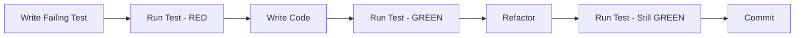
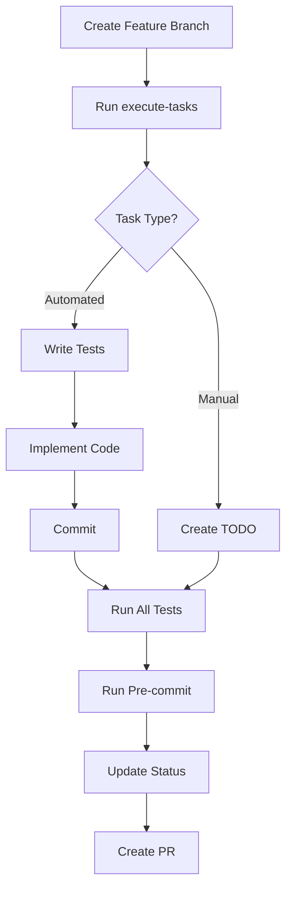

# 🚀 Task Execution Workflow Guide

Automated task implementation using Test-Driven Development (TDD) methodology with Claude.

## Overview

The task execution system automates the implementation of user story tasks, following TDD principles and creating TODOs for manual interventions.

## Quick Start

```bash
# Add to your shell configuration
alias execute-tasks="$AI_WORKSPACE/system/scripts/execute-tasks.sh"

# Execute tasks for a user story
execute-tasks my-project us-001
```

## Complete Workflow

### 1. Create Project and Planning

```bash
# Create new project
ai-plan new my-awesome-app --type web

# Edit requirements
vi ~/ai-workspace/projects/my-awesome-app/planning/requirements.md

# Generate planning documents
ai-plan generate my-awesome-app

# Deploy to GitHub
ai-plan deploy my-awesome-app --github-account myuser
```

### 2. Create Feature Branch

```bash
# Navigate to deployed project
cd ~/GitHub/myuser/my-awesome-app

# Create feature branch for user story
git checkout -b feature/us-001-user-authentication
```

### 3. Review Task Breakdown

```bash
# Check the task breakdown file
cat ~/ai-workspace/projects/my-awesome-app/planning/tasks/us-001-task-breakdown.md
```

Example task breakdown:
```markdown
# Task Breakdown: US-001 User Authentication

## Tasks

### 1. Setup Authentication Module
- [ ] Create auth service structure
- [ ] Setup JWT token handling
- [ ] Configure password hashing
Estimate: 4 hours

### 2. Implement Login Endpoint
- [ ] Create login controller
- [ ] Add input validation
- [ ] Write unit tests
Estimate: 3 hours

### 3. Configure AWS Cognito (Manual)
- [ ] Create user pool in AWS Console
- [ ] Configure app client
- [ ] Set up triggers
Estimate: 2 hours
```

### 4. Execute Tasks

```bash
# Run the task executor
execute-tasks my-awesome-app us-001
```

The system will:
1. ✅ Verify you're on a feature branch
2. ✅ Read task breakdown
3. ✅ For each automated task:
   - Write failing tests
   - Implement code
   - Commit changes
4. ✅ For manual tasks:
   - Create detailed TODOs
5. ✅ Run all tests
6. ✅ Run pre-commit checks
7. ✅ Update task status

### 5. Review Generated TODOs

```bash
# Check created TODOs
ls ~/ai-workspace/todos/active/my-awesome-app/

# Read specific TODO
cat ~/ai-workspace/todos/active/my-awesome-app/todo-001-aws-cognito.md
```

### 6. Complete Manual Tasks

Follow the step-by-step instructions in each TODO file.

### 7. Verify Implementation

```bash
# Run tests
npm test

# Check coverage
npm test -- --coverage

# Run pre-commit
pre-commit run --all-files

# Check git history
git log --oneline
```

## Task Executor Features

### TDD Cycle



### Automatic Commits

Each task gets committed with conventional commit messages:

```bash
test: add failing tests for login endpoint
feat: implement login endpoint
refactor: improve error handling in auth service
fix: resolve test failures in JWT validation
chore: fix linting issues
docs: update task breakdown status
```

### Manual Task TODOs

For tasks that cannot be automated, detailed TODOs are created:

```markdown
# TODO: Configure AWS Cognito User Pool

Priority: High
User Story: US-001

## Step-by-Step Instructions

1. **Login to AWS Console**
   - URL: https://console.aws.amazon.com
   - Region: us-east-1

2. **Navigate to Cognito**
   - Services → Security, Identity & Compliance → Cognito

3. **Create User Pool**
   - Click "Create user pool"
   - Name: my-awesome-app-users
   - [Detailed configuration steps...]
```

## Project Type Adaptations

### Web Applications (React/Vue/Angular)

```bash
# Test commands
npm test          # Run tests
npm test -- --watch  # Watch mode
npm test -- --coverage  # With coverage

# Pre-commit setup
npx husky install
npx lint-staged
```

### API Services (Node.js/Python/Go)

```bash
# Node.js
npm test
npm run test:integration

# Python
pytest
pytest --cov=src

# Go
go test ./...
go test -cover
```

### CLI Tools

```bash
# Test commands vary by language
cargo test        # Rust
go test ./...     # Go
pytest           # Python
npm test         # Node.js
```

## Configuration

### Pre-commit Setup

Ensure `.pre-commit-config.yaml` exists:

```yaml
repos:
  - repo: https://github.com/pre-commit/pre-commit-hooks
    rev: v4.4.0
    hooks:
      - id: trailing-whitespace
      - id: end-of-file-fixer
      - id: check-yaml
      - id: check-added-large-files

  - repo: https://github.com/psf/black
    rev: 23.1.0
    hooks:
      - id: black
        language_version: python3

  - repo: local
    hooks:
      - id: tests
        name: tests
        entry: npm test
        language: system
        pass_filenames: false
```

### Test Framework Setup

#### Jest (JavaScript/TypeScript)

```json
{
  "scripts": {
    "test": "jest",
    "test:watch": "jest --watch",
    "test:coverage": "jest --coverage"
  },
  "jest": {
    "testEnvironment": "node",
    "coverageThreshold": {
      "global": {
        "branches": 80,
        "functions": 80,
        "lines": 80,
        "statements": 80
      }
    }
  }
}
```

#### Pytest (Python)

```ini
# pytest.ini
[tool:pytest]
testpaths = tests
python_files = test_*.py
python_functions = test_*
addopts = --verbose --cov=src --cov-report=term-missing
```

## Best Practices

### 1. Feature Branch Naming

```bash
feature/us-001-brief-description
feature/us-002-another-feature
bugfix/us-003-fix-auth-issue
```

### 2. Commit Message Format

```bash
# Format: <type>: <description>

# Types:
feat: New feature
fix: Bug fix
test: Adding tests
docs: Documentation
refactor: Code refactoring
chore: Maintenance tasks
```

### 3. Test Organization

```javascript
describe('AuthService', () => {
  describe('login', () => {
    it('should return token for valid credentials', () => {});
    it('should throw error for invalid credentials', () => {});
    it('should handle database errors', () => {});
  });
});
```

### 4. TODO Management

```bash
# Active TODOs
todos/active/project-name/

# Completed TODOs (move here when done)
todos/completed/project-name/

# Blocked TODOs
todos/blocked/project-name/
```

## Troubleshooting

### "Not on feature branch" Error

```bash
# Create feature branch
git checkout -b feature/us-001-description

# Or switch to existing branch
git checkout feature/us-001-description
```

### Tests Failing

```bash
# Run specific test
npm test -- --testNamePattern="login"

# Debug mode
npm test -- --detectOpenHandles

# Verbose output
npm test -- --verbose
```

### Pre-commit Issues

```bash
# Skip hooks temporarily (not recommended)
git commit --no-verify -m "WIP: debugging"

# Fix and retry
pre-commit run --all-files
git add .
git commit -m "fix: resolve pre-commit issues"
```

### TODO Not Created

Check permissions:
```bash
ls -la ~/ai-workspace/todos/active/
mkdir -p ~/ai-workspace/todos/active/my-project
```

## Advanced Usage

### Parallel Task Execution

For independent tasks:
```bash
# Execute multiple user stories
execute-tasks my-project us-001 &
execute-tasks my-project us-002 &
wait
```

### Custom Test Commands

Edit the prompt to use project-specific test commands:
```bash
# In task-executor.md, adjust:
npm test                    # Default
yarn test                   # Yarn
pnpm test                  # PNPM
bun test                   # Bun
make test                  # Makefile
./scripts/test.sh          # Custom script
```

### CI/CD Integration

```yaml
# .github/workflows/task-execution.yml
name: Execute Tasks
on:
  workflow_dispatch:
    inputs:
      user_story:
        description: 'User Story ID'
        required: true

jobs:
  execute:
    runs-on: ubuntu-latest
    steps:
      - uses: actions/checkout@v3
      - name: Execute Tasks
        run: |
          execute-tasks ${{ github.event.repository.name }} ${{ github.event.inputs.user_story }}
```

## Summary Workflow



## Next Steps

1. [Setup Pre-commit Hooks](../setup/pre-commit.md)
2. [Configure Test Frameworks](../setup/testing.md)
3. [Review TDD Best Practices](../best-practices/tdd.md)
4. [Learn Git Workflow](../best-practices/git-workflow.md)

---

**Related Files**:
- Prompt: `system/prompts/task-executor.md`
- Script: `system/scripts/execute-tasks.sh`
- TODOs: `todos/active/[project-name]/`